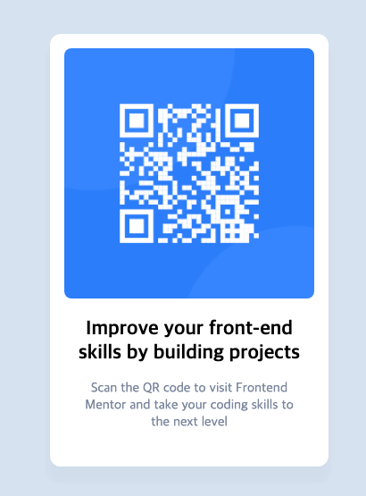

# Frontend Mentor - QR code component solution

## Table of contents

- [Overview](#overview)
    - [Screenshot](#screenshot)
    - [Links](#links)

- [Author](#author)
- [Acknowledgments](#acknowledgments)

**Note: Delete this note and update the table of contents based on what sections you keep.**

## Overview

### Screenshot

### Links
- [Live Site URL](https://fe-challenge-qr-code.vercel.app/)

## My process

### Built with

- Semantic HTML5 markup
- CSS custom properties
- Flexbox
- Mobile-first workflow

## Author

- Website - [TomboY90](https://www.your-site.com)
- Frontend Mentor - [@TomboY90](https://www.frontendmentor.io/profile/TomboY90)

